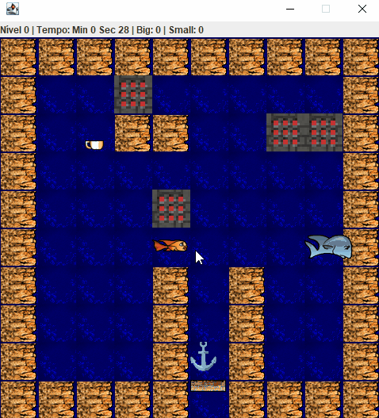
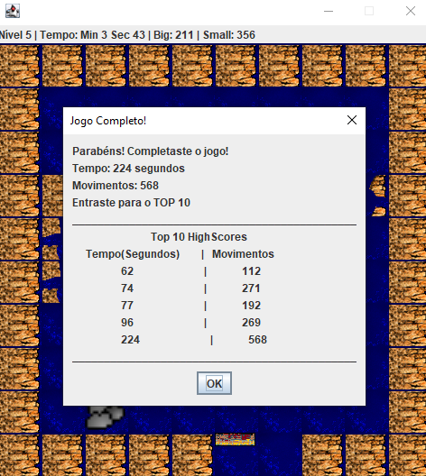

# Fish Fillets

A Java clone of the puzzle game **Fish Fillets**, built from scratch, with some GUI, Utils, Observer and GameEngine functions already provided for an Object-Oriented Programming project. Controll a small fish and a big fish in underwater rooms, pushing crates, dodging enemies, and avoiding traps - each fish has different abilities, and you must switch between them to solve every puzzle.

> Built as a university project (ISCTE - Programação Orientada a Objetos) using Java, with a strong focus on OOP design: inheritance hierarchies, interfaces for cross-cutting behavior, and the Observer and Singleton patterns.



## Gameplay

- Control two fish - a **Small Fish** (can pass through walls with holes, weak) and a **Big Fish** (can't pass through holes, but can push heavier objects) - and swap between them with `Space`.
- Push movable objects (cups, anchor, stones) out of the way, respecting weight and gravity rules.
- Avoid traps and enemies (crabs that spawn from cracked stones), and watch out for objects falling on you.
- Trigger bombs to destroy nearby breakable blocks.
- Complete all 6 rooms to finish the game and set a high score based on time and total moves.

**Controls**

| Key | Action |
|---|---|
| `↑ ↓ ← →` | Move the active fish |
| `Space` | Switch between Small Fish and Big Fish |
| `R` | Restart the current level |

## Features

- **6 hand-crafted levels**, loaded at runtime from plain-text room layouts (`rooms/room0.txt` … `room5.txt`), so new levels can be added without touching any code.
- **Physics simulation**: gravity applied every tick, object pushing with weight/heaviness rules, and multi-object chain pushes.
- **Enemies & hazards**: crabs that spawn dynamically from stones, traps, bombs with area-of-effect explosions, and breakable blocks.
- **Persistent high-score table** (time + move count) saved to disk between sessions.
- **Custom rendering engine** built on Java Swing/AWT, driving a tile-based grid GUI with a live status bar (level, elapsed time, moves per fish).



## Object-Oriented Design

This project's main goal was applying solid OOP principles rather than just "making the game work":

- **Abstraction & inheritance** - `GameObject` is the root of every entity in a room; `GameCharacter` extends it and is specialized by `SmallFish` and `BigFish`, each overriding movement rules, push logic, and death conditions.
- **Interfaces for cross-cutting behavior** - capabilities like `Breakable`, `Passable`, `GravityApplied`, `CanPassWall`, and `Enemy` are modeled as interfaces, so unrelated classes (e.g. `Log`, `Crab`, `Bomb`) can share behavior without forcing them into the same inheritance branch.
- **Observer pattern** - the GUI (`ImageGUI`) notifies the `GameEngine` on every tick/key press through a custom `Observer`/`Observed` implementation, decoupling input/rendering from game logic.
- **Singleton pattern** - `SmallFish` and `BigFish` are singletons, reflecting that there is exactly one instance of each character throughout the game's lifecycle.
- **Encapsulated level loading** - `Room` parses text-based level files into live `GameObject` instances via a factory-style switch, keeping level data completely separate from game logic.

## Game Elements
### Characters
* **Small Fish:**
    * Can pass **Holed Walls**.
    * Only can push **1 light object**.
    * He dies if he supporting more than 1 light object or any heavy object.
* **Big Fish:**
    * Can push multiple light objects or heavy objects.
    * If he is supporting more than one heavy object he dies.

## Objects and Interactions

Below is a comprehensive list of the implemented entities and their core behaviors:

| Entity | Category | Gameplay Rules |
| :--- | :--- | :--- |
| **Wall** | Static | Acts as an impassable barrier. Capable of supporting the weight of any item. |
| **Steel (Pipe)** | Static | Obstacle that strictly denies passage. |
| **Trunk (Wood)** | Static | Shatters and vanishes when crushed by a heavy item falling on it. |
| **Cup** | Lightweight | A standard item affected by regular downward gravity. |
| **Stone** | Heavyweight | Drops downwards and is lethal to the fish. Shifting it may reveal a hidden Krab. |
| **Anchor** | Heavyweight | Horizontal pushing is restricted to a single tile at a time. |
| **Bomb** | Lightweight | Detonates upon hitting the floor, wiping out nearby entities (sparing the fish that dropped it). |
| **Trap** | Heavyweight | Lethal to the Big Fish upon contact. The Small Fish can safely swim through it. |
| **Holed Wall** | Static | A barrier that exclusively allows the Small Fish to cross. |
| **Buoy** | Anti-gravity | Features **inverted gravity**. Floats towards the top of the level unless obstructed. Useful for blocking upper pathways or lifting other objects. **Only the Big Fish can push it downwards|

### Krab (Enemy than can kill the Small Fish)
An autonomous enemy that:
* Moves randomly around the scenario.
* Kills the **Small Fish** on touch.
* Is crushed/eaten by the **Big Fish**.
* *Spawn:* Can appear as a surprise when a Stone is moved.
* Only moves when the player moves.

### 💡 Physics Notes
* **Gravity:** Most movable objects fall downwards when unsupported. 
* **Anti-Gravity:** The **Buoy** is the exception to standard physics rules, constantly applying an upward force until it hits a ceiling or another blocking entity. 
* **Character Specifics:** Certain hazards and pathways are designed specifically around the distinct sizes and traits of the two fish, requiring cooperative puzzle-solving to progress.

## Tech Stack

- **Java** (core language, no external game engine)
- **Java Swing / AWT** for windowing, rendering, and keyboard input
- Plain-text files for level data and high-score persistence

## Project Structure

```
├── src/
│   ├── objects/                # Game entities: fish, enemies, blocks, hazards
│   └── pt/iscte/poo/
│       ├── game/                # GameEngine, Room, HighScore, Main
│       ├── gui/                 # ImageGUI rendering layer
│       ├── observer/            # Observer / Observed pattern
│       └── utils/               # Point2D, Vector2D, Direction
├── rooms/                       # Level layouts (plain text, one file per room)
├── images/                      # Sprites used by the GUI
├── docs/                        # Screenshots and GIFs used in this README
└── highScores.txt               # Persisted high-score table
```

## Running the Game

**Requirements:** Java JDK 8+

1. Clone the repository:
   ```bash
   git clone https://github.com/GSobral99/POOprojectFishFillets.git
   cd POOprojectFishFillets
   ```
2. Compile and run `src/pt/iscte/poo/game/Main.java` from your IDE (Eclipse/IntelliJ), or from the command line:
   ```bash
   javac -d bin -cp src src/pt/iscte/poo/game/Main.java src/objects/*.java src/pt/iscte/poo/gui/*.java src/pt/iscte/poo/observer/*.java src/pt/iscte/poo/utils/*.java
   java -cp bin pt.iscte.poo.game.Main
   ```
3. The game window opens on Room 0 - good luck! 🐠

## Authors

- **Gonçalo Sobral** - [GSobral99](https://github.com/GSobral99)
- **Dinis Sousa**

Developed as coursework for the *Programação Orientada a Objetos* course at ISCTE.

## License
Copyright (c) 2026 Gonçalo Sobral and Dinis Sousa. All rights reserved.

This repository is public for portfolio and evaluation purposes - feel free to clone it and run it locally to see the project in action. However, no permission is granted to copy, reuse, or redistribute this code, in whole or in part, without explicit permission from the authors.